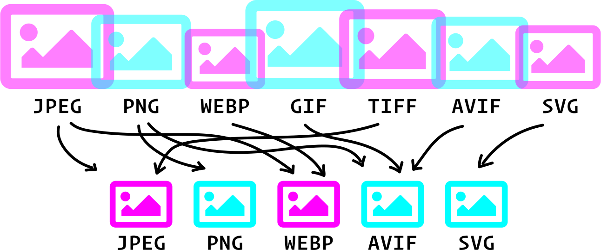

# Process image formats and sizes

A tool for using [@11ty/eleventy-img](https://github.com/11ty/eleventy-img) to process images into different formats and sizes.

## Getting started

1. `npm i`
1. Set options for the output in the `eleventy.config.js` file.
1. Place source images into the ./src/img directory.
1. Run `npx @11ty/eleventy` or `eleventy` if you previously had eleventy installed globally.

### Options

```
widths: [600, 900, 1200, 1800], // add array of width's here, Note: 11ty-img wont upscale.
formats: ['png', 'jpeg', 'webp', 'avif'], //
```

[Full options list](https://www.11ty.dev/docs/plugins/image/#usage)
